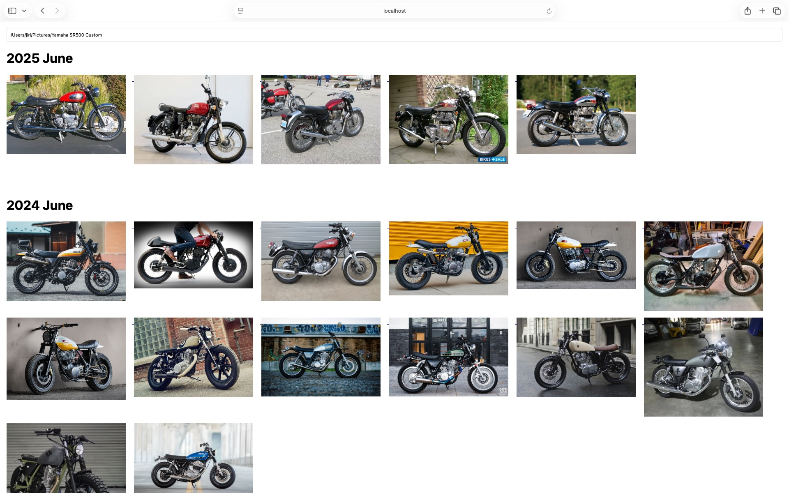
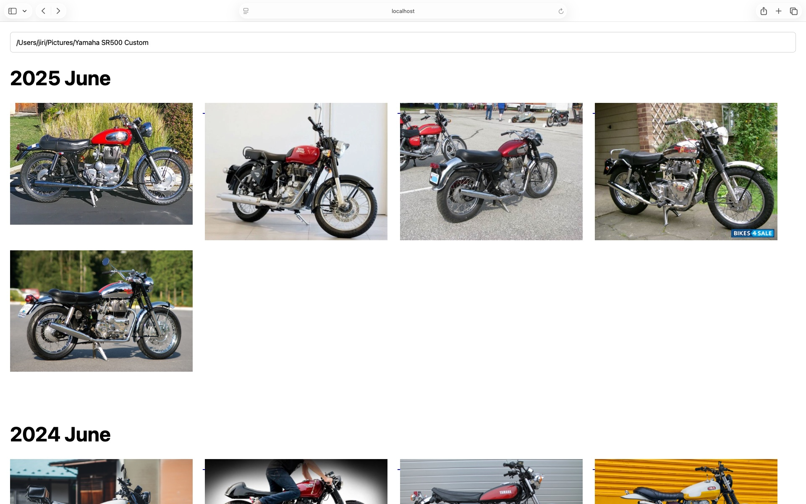
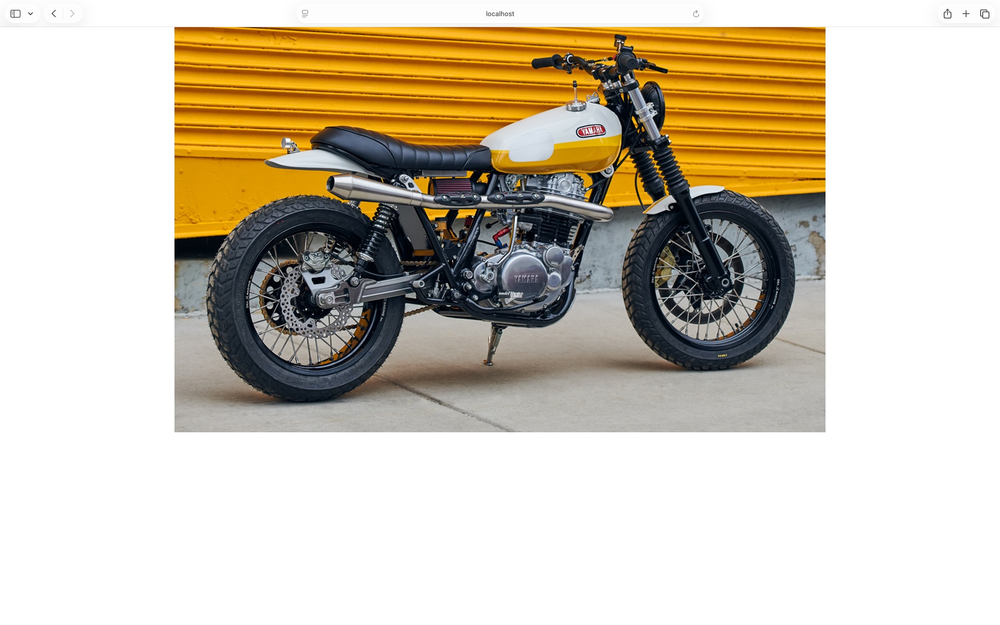

# Sigvie - The Simple Image Gallery Viewer

Sigvie is a small Python script that displays images and videos from a local folder in a chronological gallery layout, giving you a simple Google Photos-like view of your local media directly in the browser. Sigvie follows the Unix philosophy: do one thing well - for editing tags and other things, use a different complementary software.

## Demo

 






## Usage

Start the server:

```bash
python __main__.py
```

Then handwrite a directory containing images and videos in your browser.

Example:

```text
http://localhost:30000/home/jiri/Pictures
```

On macOS, the path may look like this:

```text
http://localhost:30000/Users/jiri/Pictures
```

## Controls

Use your browser zoom controls to change how many items are visible on the page:

```text
Ctrl+    zoom in
Ctrl-    zoom out
```

On a touchpad, use pinch-to-zoom to zoom individual images or adjust the page view, depending on your browser and system settings.

## Performance Notes

If a directory contains too many media files, especially thousands of images or videos, the page may become slow or laggy.

For better performance, organize your media into smaller folders and open only the folder you want to browse.


## Notes

Sigvie is intended for local use. It serves files from your local filesystem through a local web server. It contains dependency only to Python Bottle library.
